# 🗄️ Enterprise Network Rack Suite 3D — Routing Engine V4.1

[](https://developer.mozilla.org/pt-BR/docs/Web/HTML)
[](https://developer.mozilla.org/pt-BR/docs/Web/CSS)
[](https://developer.mozilla.org/pt-BR/docs/Web/JavaScript)
[](https://opensource.org/licenses/MIT)

Uma aplicação web interativa e de altíssima performance projetada para **simulação de rack físico de rede (16U)**, **cabeamento inteligente de portas (Patching)**, **rastreamento físico de rotas** e **diagnóstico automatizado de switches corporativos** em tempo real através de um dashboard de simulação SSH.

O **Enterprise Network Rack Suite 3D** une a precisão física da infraestrutura de TI com a inteligência lógica dos switches de borda e core em uma interface moderna, responsiva e com forte apelo visual (efeitos de brilho neon, transições suaves e design dark mode premium).

---

## 🧭 Sumário
1. [🎯 O que o Programa Faz?](#-o-que-o-programa-faz)
2. [⚙️ Como Funciona? (Detalhamento Técnico)](#%EF%B8%8F-como-funciona-detalhamento-t%C3%A9cnico)
3. [🏗️ Arquitetura do Software (Módulos)](#%EF%B8%8F-arquitetura-do-software-m%C3%B3dulos)
4. [🚀 Pitch Comercial & Marketing (Kit de Divulgação)](#-pitch-comercial--marketing-kit-de-divulga%C3%A7%C3%A3o)
5. [📈 Modelos de Mensagem Prontos para Uso](#-modelos-de-mensagem-prontos-para-uso)
6. [💻 Como Executar o Projeto](#-como-executar-o-projeto)

---

## 🎯 O que o Programa Faz?

O software resolve dois grandes problemas em data centers e salas de telecomunicações (NOC): **documentação física desatualizada** e **complexidade de comandos CLI para diagnósticos rápidos**.

### Recursos Principais:
*   **Visualização Dinâmica 16U**: Permite montar o rack arrastando e soltando equipamentos.
*   **Patching Inteligente**: Conexão cabo a cabo (RJ45 e SFP+) guiada por cores.
*   **Busca Universal por ID Absoluto**: Localiza instantaneamente qual porta física no rack está conectada a qual switch e qual porta de destino, apagando os outros cabos para isolar a visualização da rota.
*   **Simulador de Console SSH**: Emula o acesso a um switch corporativo da marca **Extreme Networks (Série 4220-48P-4X)**.
*   **Dashboard Executivo de Comando**: Um clique para executar diagnósticos profundos que normalmente exigiriam minutos digitando comandos de terminal.

---

## ⚙️ Como Funciona? (Detalhamento Técnico)

A aplicação é dividida em dois ambientes principais que interagem através de um barramento de estado compartilhado (`js/state.js`):

### 1. Motor Físico do Rack & Drag & Drop (`js/rack-engine.js`)
*   **Instanciação Dinâmica**: Usuários podem adicionar novos **Patch Panels** (24 portas RJ45) ou **Switches** (48 portas RJ45 + 4 portas SFP+ de 10G) ao rack de 16U.
*   **Drag & Drop Inteligente**: É possível arrastar qualquer equipamento para cima ou para baixo para reorganizar os slots físicos.
    *   *Como funciona o Swap:* Se o slot de destino estiver ocupado, o motor realiza um swap (troca de posição física) entre os dois equipamentos de forma transparente.
    *   *Persistência de cabos:* Ao mover os equipamentos, todas as conexões de cabos conectadas a eles são recalculadas e renderizadas nas novas coordenadas instantaneamente.

### 2. Motor Vetorial de Cabeamento SVG (`js/cable-renderer.js`)
*   **Curvaturas Perfeitas**: Os cabos não são linhas retas genéricas. O motor calcula curvas de Bezier cúbicas (`C` no SVG Path) para simular o caimento natural de cabos físicos de par trançado.
*   **Organização Anti-Colisão**:
    *   Se as portas estão no mesmo lado do rack (esquerdo ou direito), o cabo é direcionado a canais verticais externos (guias de cabo), evitando cobrir outras portas.
    *   Se cruzam lados, o motor calcula um ponto médio (`yMid`) para realizar a transição horizontal de forma organizada.
*   **Categorização por Cores (Designação de Tráfego)**:
    *   🟤 **Beige**: Cabo CAT6 Padrão.
    *   🔵 **Azul**: Dados de Usuário (Rede corporativa).
    *   🔴 **Vermelho**: Infraestrutura Crítica (Servidores/Links de Upstream).
    *   🟡 **Amarelo**: VLAN Segregada (IoT/Visitantes).

### 3. Busca Universal Inteligente (`js/search-engine.js`)
Permite que o técnico insira um **ID Global Absoluto** (por exemplo, a identificação gravada na tomada da mesa do usuário, correspondente ao Patch Panel).
1.  O motor calcula a qual Patch Panel físico o ID pertence com base no *offset de portas acumulado*.
2.  Mapeia a porta local correta.
3.  Varre a matriz de conexões para descobrir o switch e a porta de destino.
4.  **Efeito Isolador de Rota**: Adiciona a classe `.cable-active` com filtro SVG de **Glow Neon** no cabo correto, enquanto adiciona a classe `.cable-hidden` em todos os outros cabos, aplicando transparência e facilitando a identificação imediata da rota pelo técnico.
5.  Desloca a tela suavemente (`scrollIntoView`) até o equipamento alvo.

### 4. Dashboard de Diagnósticos por SSH (`js/switch-query.js`)
Simula a automação de scripts que se conectam via SSH ao sistema operacional **ExtremeXOS (Switch Engine)** e renderizam os dados textuais em gráficos, badges e tabelas ricas.

| Card de Consulta | Comando Simulado | O que exibe na Interface |
| :--- | :--- | :--- |
| **Relatório do Sistema** | `show version` + `show switch` | Modelo, Serial, Firmware ativo, Uptime exato, Temperatura interna, Status dos coolers e Fontes redundantes. |
| **Desempenho** | `show cpu-monitoring` + `show memory` | Barras de progresso dinâmicas em tempo real indicando uso de processamento e memória RAM utilizada/total. |
| **Visão Geral de Portas** | `show ports no-refresh` | Painel gráfico de status das 52 portas (Verde = Active, Vermelho = Ready, Cinza = Disabled) com contagem de erros de transmissão TX/RX. |
| **Mapeamento de VLANs** | `show vlan` | IDs e nomes das VLANs ativas, endereços IPs de gerência e quais portas são *Tagged* (Tronco) ou *Untagged* (Acesso). |
| **Status PoE** | `show inline-power` | Consumo atual de energia em Watts em relação ao orçamento (Budget) total de 740W do Switch PoE. |
| **Tabela MAC (FDB)** | `show fdb` | Mapeamento de quais endereços MAC estão aprendidos em cada porta física e VLAN associada (estáticos ou dinâmicos). |
| **Descoberta LLDP** | `show lldp neighbors` | Dispositivos conectados nas portas (APs Extreme AP-510, telefones IP, câmeras) com seus IPs e MACs remotos. |
| **Empilhamento** | `show stacking` | Status da topologia de Stacking em Anel (Ring), elegibilidade de Master/Backup/Standby e prioridades de slot. |
| **Logs de Eventos** | `show log` | Console de syslog interativo que filtra e apresenta alertas de severidade (INFO, WARNING, CRITICAL). |

*   **Varredura Completa de Um Clique**: Executa todas as 9 consultas sequencialmente com uma animação de barra de progresso unificada, simulando a execução automatizada de um relatório de saúde completo da infraestrutura.

---

## 🏗️ Arquitetura do Software (Módulos)

A estrutura do projeto foi planejada para modularidade absoluta e facilidade de manutenção. Cada arquivo tem uma responsabilidade isolada:

```mermaid
graph TD
    A[index.html] --> B[css/]
    A --> C[js/]
    
    subgraph CSS_Styles [Folhas de Estilo - css/]
        B --> B1[main.css - Layout base]
        B --> B2[dashboard.css - Telas do Switch]
        B --> B3[rack.css - Desenho do Rack]
        B --> B4[ports.css - Grade de Portas RJ45]
        B --> B5[sidebar.css - Painel esquerdo]
        B --> B6[cables.css - Cabos e Animações]
        B --> B7[variables.css - Cores e Tokens]
    end

    subgraph JS_Modules [Lógica da Aplicação - js/]
        C --> C1[state.js - Estado Global compartilhado]
        C --> C2[logger.js - Console de log na tela]
        C --> C3[cable-renderer.js - Traçado SVG]
        C --> C4[rack-engine.js - Drag & Drop e Hardware]
        C --> C5[patching.js - Conexões manuais/clique]
        C --> C6[search-engine.js - Algoritmo de busca]
        C --> C7[switch-query.js - Emulação de SSH e Dashboard]
        C --> C8[app.js - Bootstrap e Resize Listeners]
    end
```



---

## 🚀 Pitch Comercial & Marketing (Kit de Divulgação)

Como apresentar este produto para o mercado, clientes ou investidores? Aqui estão os argumentos comerciais mais fortes do **Enterprise Network Rack Suite 3D**.

### 💡 A Proposta de Valor (O que vende o software)
*   **"Chega de planilhas desatualizadas!"**: O software substitui o controle de portas de rede feito em Excel por um gêmeo digital interativo onde o técnico vê exatamente o rack real.
*   **"Redução do tempo de troubleshooting (MTTR) em até 80%"**: Em vez de ir à sala de servidores testar cabos com testador físico, o técnico usa a Busca Universal para identificar o caminho físico e já abre o dashboard SSH do switch para ver se a porta está ativa ou gerando erros de TX/RX.
*   **"Treinamento sem riscos"**: Excelente para empresas e escolas técnicas treinarem novos operadores de NOC sobre conceitos de Stacking, PoE, VLANs taggeadas e roteamento físico de cabos sem o risco de derrubar a rede de produção de um cliente real.

### 💎 Diferenciais Estéticos (O "Uau" visual)
*   **Estética Cyberpunk/Enterprise Dark**: A interface escura com gradientes sutis e efeitos neon faz o software parecer uma ferramenta futurista de salas de controle de alta tecnologia (como da NASA ou grandes ISPs).
*   **Transição de Abas Fluida**: A transição suave entre a visualização 3D do Rack e o Dashboard Clínico do Switch proporciona uma experiência de uso extremamente moderna.
*   **Feedbacks Dinâmicos**: Tooltips interativos nas portas RJ45 do dashboard mostram a velocidade de link e status da porta imediatamente ao passar o mouse.

---

## 📈 Modelos de Mensagem Prontos para Uso

Use os textos abaixo para divulgar o projeto nas suas redes de contatos.

### 👔 Opção 1: LinkedIn (Foco em Profissionalismo e Portfólio)
> 🚀 **Gêmeos Digitais na Infraestrutura de TI: Menos planilhas de Excel, mais gestão visual e dinâmica!**
>
> Acabo de desenvolver o **Enterprise Network Rack Suite 3D (Routing Engine V4.1)**. Um projeto web interativo voltado para a administração visual de racks de rede corporativos e diagnósticos rápidos de switches.
>
> 💡 **O que ele traz de inovação:**
> * **Simulação Física Interativa (16U):** Organize os switches e patch panels arrastando-os pelo rack, com auto-ajuste dinâmico e inteligente das conexões físicas.
> * **Algoritmo de Roteamento de Cabos SVG:** Curvatura realista de cabos com canais verticais anti-sobreposição e categorização por cores para dados, voz e links críticos.
> * **Busca Inteligente por ID Absoluto:** Digite o ID do ponto de rede do usuário e o sistema localiza a porta exata, ativa um traçado neon e oculta os demais cabos para isolar visualmente a rota física.
> * **Dashboard de Diagnósticos SSH (ExtremeXOS):** Simulação de console SSH para checar VLANs, PoE, Stacking, vizinhança LLDP, tabela MAC e taxas de erros de pacotes com um clique.
>
> Projetos como esse reduzem drasticamente o MTTR (Mean Time to Resolution) em equipes de suporte e NOC, além de servirem como uma poderosa ferramenta de capacitação técnica segura.
>
> Confira a arquitetura modular e o código-fonte! O que acharam dessa abordagem de gerenciamento de infraestrutura? 🛠️💻
>
> \#RedesDeComputadores #DataCenter #SoftwareEngineering #Dev #Frontend #SysAdmin #ExtremeNetworks #HTML5 #JavaScript #CSS

---

### 💬 Opção 2: WhatsApp / Telegram (Foco em Comunidades e Grupos de TI)
> Fala pessoal, beleza? Queria compartilhar com vocês um projeto que finalizei focado em infra de redes e NOC. 
> 
> É o **Enterprise Network Rack Suite 3D**! 🗄️⚡
> 
> É basicamente um simulador web de rack de telecom onde você consegue:
> 1. Montar o rack dinamicamente arrastando os switches e patch panels (com swap de slots).
> 2. Passar cabos virtuais clicando nas portas e selecionando a cor do serviço (VLAN, Servidores, etc).
> 3. Rastrear rotas físicas digitando o ID Global (ele destaca o cabo em Neon e apaga o resto pra você não se perder na fiação virtual).
> 4. Rodar um "Full Scan" simulando comandos SSH de Switches Extreme (show version, show fdb, show cpu, show inline-power, lldp, stacking e syslog).
> 
> Ficou com uma cara bem premium (dark mode com neon e transições lisas). Para portfólio de engenharia de software e suporte, ficou sensacional.
> 
> Quem quiser dar uma olhada no código ou rodar na máquina, me avisa! 🚀

---

### 📧 Opção 3: E-mail (Para Empresas de TI, Provedores ou Clientes Finais)
> **Assunto:** Solução Visual de Gestão de Racks de Rede e Diagnósticos Inteligentes
>
> Prezado(a),
>
> Manter a documentação dos racks de servidores e switches atualizada é um dos principais desafios das equipes de TI. A dependência de planilhas manuais ou diagramas estáticos frequentemente resulta em lentidão no diagnóstico de incidentes físicos.
>
> Para solucionar essa lacuna de forma ágil, apresento o **Enterprise Network Rack Suite 3D**. Uma plataforma web focada em gerenciamento visual de infraestrutura física e diagnósticos de ativos em tempo real.
>
> **Benefícios operacionais da ferramenta:**
> * **Mapeamento Físico Dinâmico:** Gestão por arrastar e soltar (Drag & Drop) de ativos com recálculo instantâneo de cabos.
> * **Troubleshooting de Rota Isolada:** O técnico digita o identificador da tomada física e o sistema aplica um rastreamento luminoso isolado no cabo correspondente, eliminando o tempo de busca visual no rack.
> * **Console de Diagnóstico SSH Emulado:** Acesso visual rápido a informações críticas como temperatura, consumo PoE de telefones/APs, topologia de Stacking, vizinhança LLDP e logs de erro do switch, sem a necessidade de digitação manual de comandos CLI.
>
> Esta solução melhora sensivelmente a eficiência operacional de equipes de NOC (Network Operations Center), reduzindo o tempo de resolução de chamados de rede e servindo como um catálogo digital dinâmico e seguro de toda a estrutura física.
>
> Estou à disposição para realizar uma demonstração prática da ferramenta e discutir como ela pode ser adaptada para a topologia física da sua empresa.
>
> Atenciosamente,
>
> **[Seu Nome/Sua Empresa]**  
> [Seu Link de Portfólio / GitHub / LinkedIn]

---

## 💻 Como Executar o Projeto

Como o software foi desenvolvido utilizando tecnologias puras da web (**Vanilla HTML5, CSS3 e Javascript**), ele é extremamente leve e não necessita de nenhuma compilação ou instalação complexa.

1.  Baixe a pasta do projeto em seu computador.
2.  Dê dois cliques no arquivo `index.html` para abri-lo diretamente em qualquer navegador moderno (Chrome, Edge, Firefox, Safari).
3.  *Opcional para Desenvolvimento:* Se desejar rodar em um servidor local de desenvolvimento para recarregamento automático (Live Reload):
    ```bash
    # Se você tiver o Node.js/NPM instalado:
    npx serve .
    
    # Ou se usar Python no terminal:
    python -m http.server 8000
    ```
    Em seguida, acesse `http://localhost:8000` no seu navegador.
